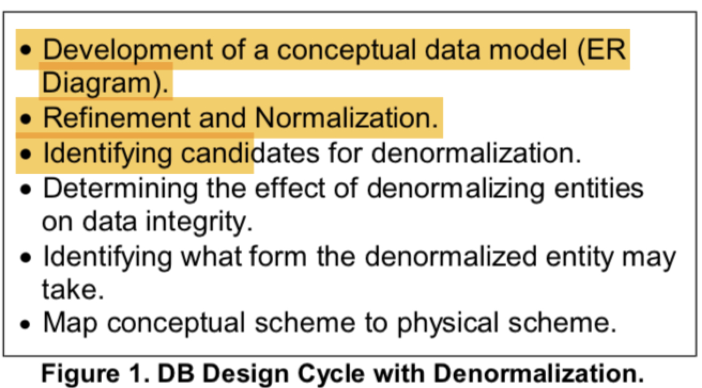
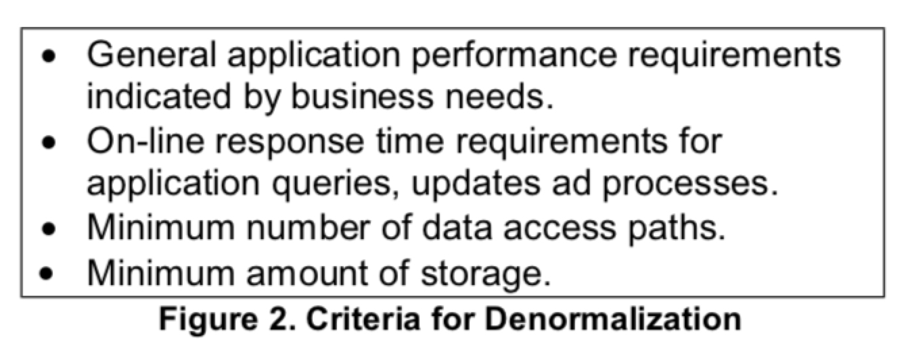
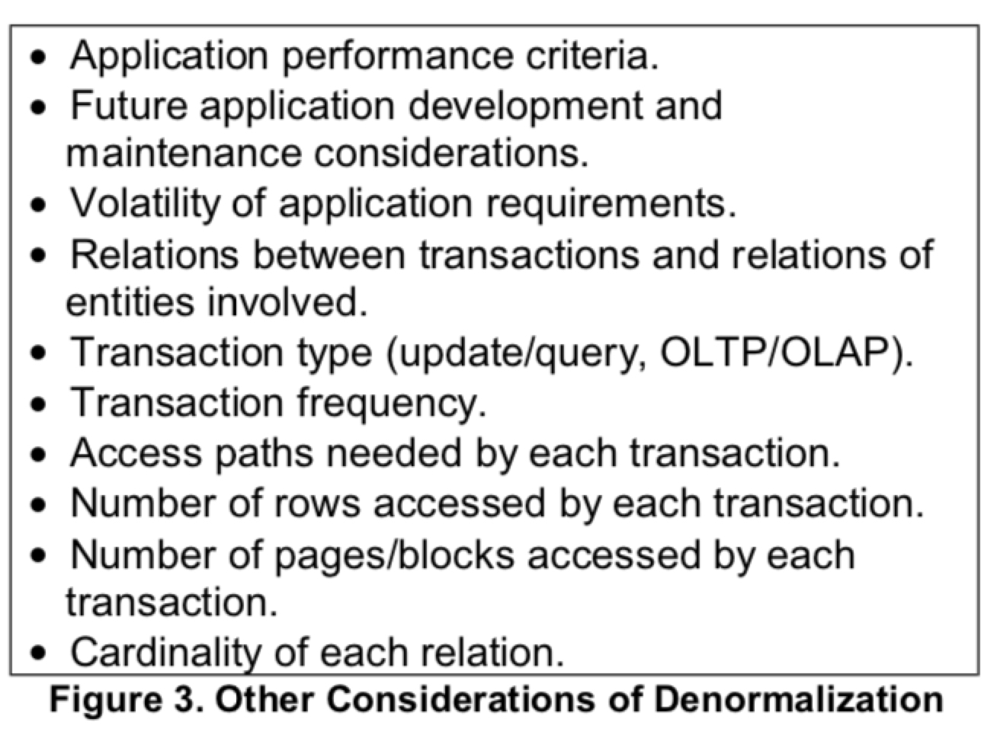

**Denormalization**  => process of reducing the degree of normalization with the aim for improving query performance.

Goal of a **data warehouse** is to put data in the hands of **people that make decisions**.

Complexity lies in making sure the target database holds only **accurate, timely, integrated, valid and credible data**.

Good candidates for denormalization include:
1.  Multidimensional analysis in a complex hierarchy, aggregations, complicated calculations.
	Example : Time ( year, quarter, month, and date )

What to consider?
1.  Consider the frequency of updates in data.
2.  Tradeoffs b/w flexibility and performance.

### Denormalization Process Model:

 Goals:
 1.  More user oriented view of data, less complex.
 2. This is accomplished by **reducing number of physical tables**. ( reducing no. of joins required to answer a query).

### DB Design Cycle:

### Criteria for Denormalization:

### Update Anomaly problems:

1. Can be solved using triggers, batch reconcilation, application logic.
2. Triggers => Best solution, costly in terms of performance.
3. Application logic in each application => ensure changes are atomic.
4. Batch reconcilation => can run at appropriate intervals to bring data back into aggreement.

### Minimize downsides / deleterious effects of denormalization:
